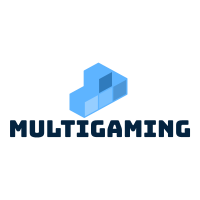
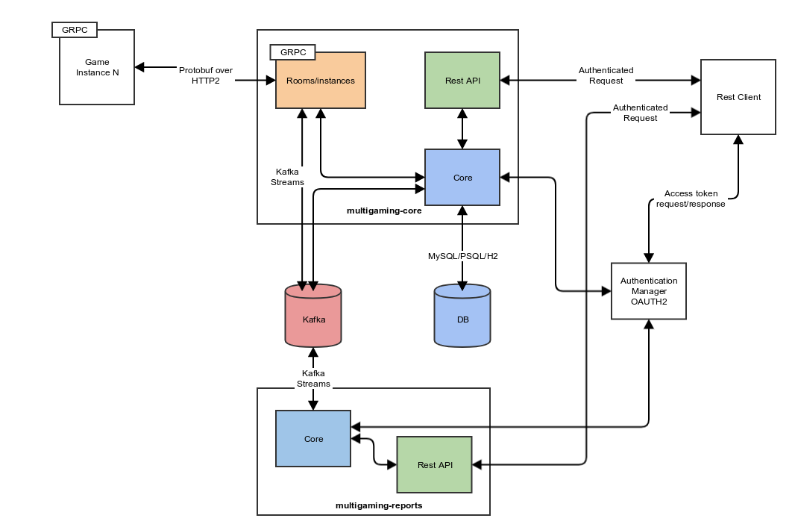

# Multigaming
### multigaming-core
Mutigaming core application 

 

## What is MGio
Is a context agnostic multiplayer gaming framework. Uses the gRPC protocol for the exchange of events and actions.

The main idea of MGio is to allow developers to have a robust multiplayer framework that can be integrated easily with their games.

It is currently compatible with unity via the library and via the multigaming-client for java, we are aiming to create gRPC examples for the main major gaming languages in the future.

## Why gRPC?
Framework agnosticity. Once the proto file is available, the developer can create its own implementation of gRPC in order to follow the flow of the framework.
Also with the duplex streaming feature, the applications can have real time exchange between the server and other users.

## Architecture Overview


Multigaming-core is a monolithic multi instance API. It exposes a REST API and a gRPC connection.

- The goal of the REST API is to allow the easy configuration of the users, rooms and games.
- The gRPC is aimed to handle the real time exchange during a game. This will be called a game instance.
- A game instance can have multiple players and is configurable with clear rules.

## Requirements
Multigaming-core is an standalone application with only the datasources dependency.
- Java 8
- Kafka cluster
- MySQL, PostgreSQL, H2 

## About the project
The project is created using micronaut and Java. To compile it and run it, it is encouraged to install micronaut framework.

## Installation
```jshelllanguage
$ ./gradlew build
$ ./gradlew run
```
